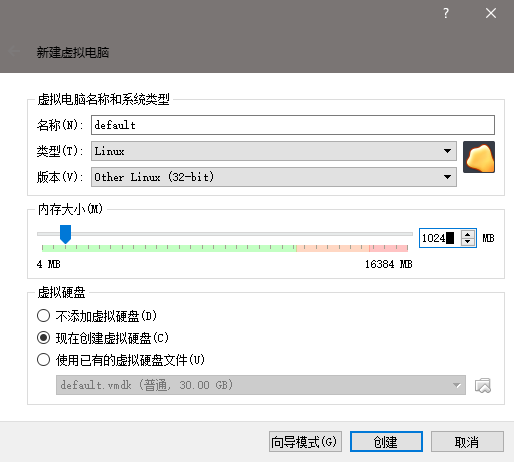
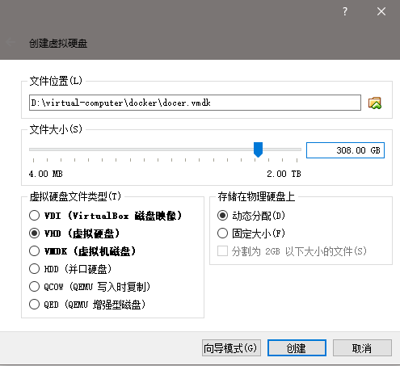
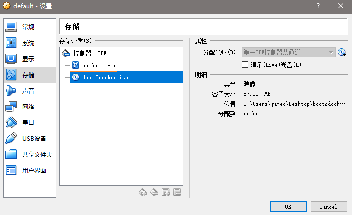

# docker toolbox

docker -> go语言编写的一种虚拟机（容器）-> 微服务

因为系统的复杂性（环境->依赖）

每一个docker容器，都是独立的（隔离的），在隔离的容器中，每一个跑在容器中的软件，都有自己的独立的依赖，这样的好处的是，依赖文件（不同的版本）可以独立，不会出现交叉或者版本冲突

为什么要装虚拟机和docker，因为我们爬虫需要的splash浏览器，就是基于docker的。

boot2docker.iso -> docker相关系统的引导文件 -> 让虚拟机可以运行某个操作系统的引导程序

安装了docker toolbox -> oracle virtualbox 虚拟机

我们安装了docker toolbox后，为了方便管理，我们不使用docker quickstart terminal来运行docker

而是采用运行`C:\Program files\oracle\Virtual Box\VirtualBox.exe`来手动安装docker虚拟机

配置号boot2docker.iso后，我们就可以启动虚拟机了

等虚拟机启动完毕后，我们可以看到命令行提示符

`docker@boot2docker:~$`

docker是用户

boot2docker是机器名称

~代表Home目录

$代表用户提示符

## 常用命令

pwd -> 显示当前目录

ls -> 列出当前目录中的目录和文件

cd -> 改变当前目录，例如： cd /  cd ~

cat /proc/cpuinfo

ls -la 以long和attrib方式列出当前目录中的文件和目录（包含了隐藏文件和目录）

mkdir 目录名称

chmod xxx 目录/文件名称 xxx 代表 8进制的权限模式 0-7

​		0表示去除对应用户的权限

​		1表示设置可执行的权限（目录必须带有一个x）

​		2表示设置可写入的权限（w）

​		3表示1+2（可写可执行wx）

​		4表示设置可读取的权限（r）

​		5表示1+4(可读可执行)

​		6表示2+4(可读可写)

​		7表示1+2+4(可读可写可执行)

d---rw-rwx 如果权限为这样：只有root用户能够进入该目录

dr-xr-xr-x 如果权限为这样：555 那么也是可以进入该目录的

rm -rf 目录 强制删除目录，包含目录中的子目录与文件

rm -f * 删除目录中的所有文件

mv source文件/目录 target文件/目录

cp source_path target_path

adduser addgroup

deluser delgroup

pswd

软件安装-> ubuntu linux(apt) centos(yum)

## 安装splash

docker pull scrapinghub/splash

