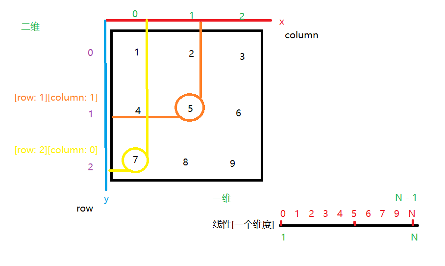
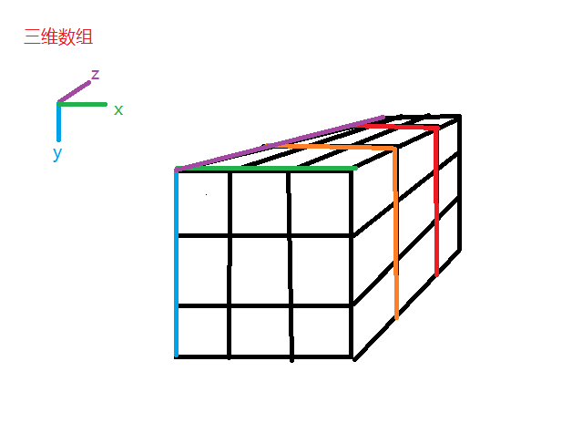
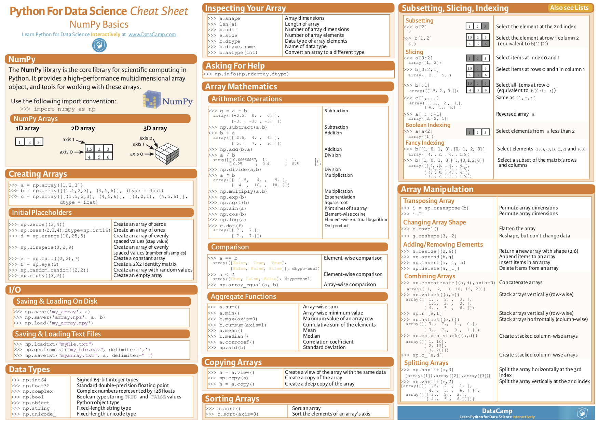

## 什么是Numpy

Python的一种科学计算工具


## 为什么使用Numpy

因为它快！


## Numpy的用途

1. 密集的数据计算
2. python自身不擅长的计算(性能问题)


## Numpy中的NDArray

1. 什么是`ndarray`

   n -> 多

   d -> 维度

   array -> 数组

   多维数组（因为numpy的ndarray不是python实现，而是底层语言实现，并对其优化）

2. 创建ndarray的几种方式

   ```python
   import numpy as np
   
   # 利用python的list对象进行创建(列表)
   arr1 = np.array([1, 3, 5, 7, 9])
   # 利用python的tuple对象进行创建(元组)
   arr2 = np.array((2, 4, 6, 8, 10))
   # 利用numpy的arange()函数进行创建
   arr3 = np.arange(10)
   # 利用numpy的linspace()函数进行创建
   arr4 = np.linspace(0, 2 * np.pi, 5)
   
   # 如果我们要对这些ndarray进行输出，可以直接使用python中的print函数
   # 或者使用下标
   ```

   ```python
   import numpy as np
   
   # 创建ndarray的方法
   arr1 = np.array([1, 3, 5, 7, 9])  # 通过 python 的 list 创建
   arr2 = np.array((2, 4, 6, 8, 10)) # 通过 python 的 tuple 创建
   arr3 = np.arange(5) # 这是通过 numpy 的 arange 函数创建
   arr4 = np.linspace(0, 2 * np.pi, 5) # 3.1415 * 2
   arr5 = np.linspace(0, 100, 6)
   print(type(arr1))
   print(len(arr4))
   print(arr4[len(arr4) - 1]) # 通过下标的方式访问（numpy数组支持python语法）
   
   for i in reversed(range(len(arr4))):
       print('{:.2f}'.format(arr4[i]))
   ```

3. 维度

    
    
    

```python
# 一维与二维数组的问题
one_d_array = [0, 1, 2, 3, 4, 5]

two_d_array = [
    [1, 2, 3],
    [4, 5, 6],
    [7, 8, 9]
]

t = one_d_array[3]
#               x: coord(index)

e = two_d_array[2][1]
#               y  x  y:row x:column
```

```python
# 三维数组的维度问题
import numpy as np

# 多维问题
three_d_array = [
    [
        [1, 2, 3],  
        [4, 5, 6],
        [7, 8, 9]
    ],
    [
        [-1, -2, -3],  
        [-4, -5, -6],
        [-7, -8, -9]
    ],
    [
        ['a', 'b', 'c'],  # 访问这里的第二个元素 'b'
        ['d', 'e', 'f'],
        ['g', 'h', 'i']
    ],
]
b = three_d_array[2][0][1]
#                 z  y  x
# 上述代码，由于第3层中的数据是文本类型（str），所以在转换为ndarray后，无法参与正常的运算
# 因为numpy.ndarray是需要保证数组中的所有元素必须是相同的数据类型
```


## 杂项
numpy基础作弊表



