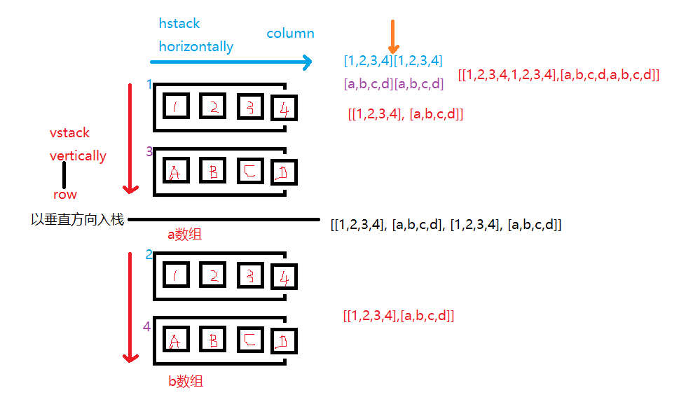
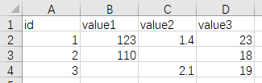
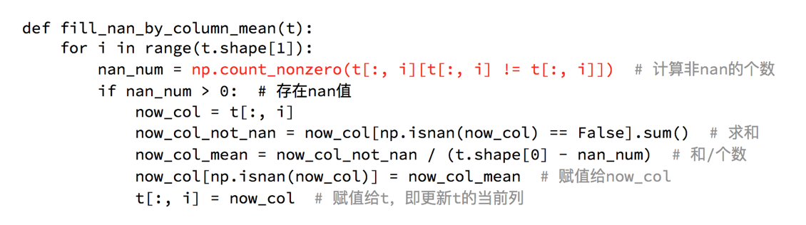

# numpy数组的合并与分割


## 合并

```python
np.concatenate()	# 合并
np.vstack()		    # 垂直合并
np.hstack()			# 水平合并
```

Example:

```python
mu, sigma = 0.0, 1.0
stock_day_rise = np.random.normal(mu, sigma, [500, 504])

a = stock_day_rise[:2, 0:4]  # 提取1，2两支股票的前四天数据
b = stock_day_rise[10:12, 0:4] # 提取11,12两支股票的前四天数据

# axis=1时候，按照数组的列方向拼接在一起
# axis=0时候，按照数组的行方向拼接在一起
# 合并a,b两个数组
print(np.concatenate([a, b], axis=0))

print("垂直合并：")
print(np.vstack([a,b]))
print("水平合并：")
print(np.hstack([a,b]))
```




## 分割

```python
print('分割后：')
print(np.split(a, [3], axis=1)[0])
```


# CSV文件的读取与整理

```python
arr:np.ndarray = genfromtxt(path, delimiter=',')
print(arr)
```



```
[[  nan   nan   nan   nan]
 [  1.  123.    1.4  23. ]
 [  2.  110.    nan  18. ]
 [  3.    nan   2.1  19. ]]
```

建议使用均数来填充nan



```python
import numpy as np

# 从data.csv中载入数据到numpy数组中
arr = np.genfromtxt('./data.csv', delimiter=',')
data = arr[1:, :]  # 去除掉field name占用的第一行

# 通过列中的均值，填充nan缺失部分
def fill_non_by_column_mean(t):
    for i in range(t.shape[1]): # i 的意义在于 列数 的迭代
        nan_num = np.count_nonzero(t[:, i][t[:, i] != t[:, i]])
        if nan_num > 0:
            cur_col = t[:, i]
            cur_col_not_nan_sum =cur_col[np.isnan(cur_col) == False].sum()
            effective_col_mean = cur_col_not_nan_sum / (t.shape[1] - nan_num)
            cur_col[np.isnan(cur_col)] = effective_col_mean
            t[:, i] = cur_col
        
# 调用函数整理数据表中的缺失值
fill_non_by_column_mean(data)
# 输出
print(data)
```

