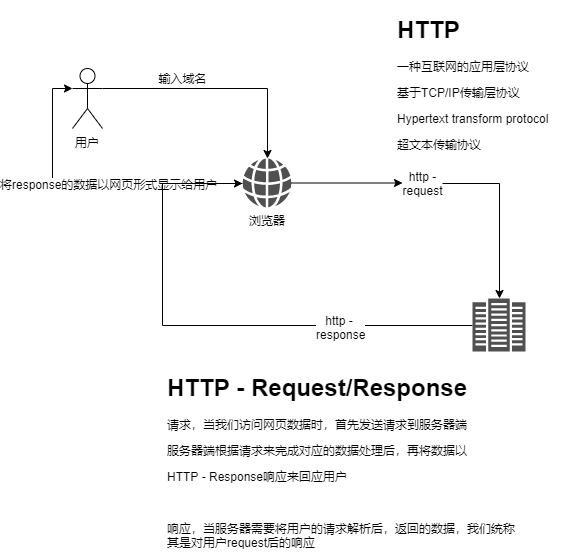

# Python Scrapy爬虫框架

## 安装

1. windows下我们要安装visual studio 2019部分内容

   https://visualstudio.microsoft.com/zh-hans/vs/

   下载社区版

   

2. 安装scrapy的python第三方包

   ```powershell
   python -m pip install scrapy
   python -m pip install scrapy-splash
   ```

   

## 快速入门

### 创建项目与蜘蛛

```powershell
scrapy startproject <项目名称> [项目的目录名称]
scrapy genspider <蜘蛛名称> [域名]
```

### 目录结构

```shell
D:\PACHONG\BAIDU                           # 目录名称
│  scrapy.cfg                              # scrapy配置文件 cfg -> configure
│
└─lianxi                                   # lianxi这个目录是项目名称
    │  items.py                            # 爬取到的'数据项目'
    │  middlewares.py                      # 中间层
    │  pipelines.py                        # 爬取到的'数据项目'的管道
    │  settings.py                         # 本项目配置文件
    │  __init__.py                         # __init__.py '包'的初始化文件
    │
    └─spiders                              # 蜘蛛程序存放的目录（蜘蛛目录）
       │  goods.py                         # 具体的蜘蛛代码文件（可以多个）
       |  members.py                       # (一个蜘蛛文件对应爬取某个网站块)
       └─ __init__.py                      # __init__.py spider包的初始化文件
```


## 修改settings.py

```python
ROBOTSTXT_OBEY = False					# 爬虫的君子协议，我们不是君子

DOWNLOAD_DELAY = 3						# 下载延迟，建议设置3或者以上

# 数据项目的管道
ITEM_PIPELINES = {
   'baidu.pipelines.BaiduPipeline': 300,
}
```


## 修改items.py

```python
# -*- coding: utf-8 -*-

# Define here the models for your scraped items
#
# See documentation in:
# https://docs.scrapy.org/en/latest/topics/items.html

import scrapy

# item就是我们需要爬取的数据项目，项目中含有数据字段
# 下面是一个商品抽象的具体属性（jd.com的商品列表中的某个商品数据）
class BaiduItem(scrapy.Item):
    # define the fields for your item here like:
    # name = scrapy.Field()
    name = scrapy.Field()     # 商品名称
    price = scrapy.Field()    # 商品价格
    commit = scrapy.Field()   # 评论数量
    image = scrapy.Field()    # 商品的图片链接
    shop = scrapy.Field()     # 店铺的名称
    state = scrapy.Field()    # 店铺的类型
```


## 修改蜘蛛文件

```python
# -*- coding: utf-8 -*-
import scrapy


class HomepageSpider(scrapy.Spider):
    name = 'homepage'
    allowed_domains = ['baidu.com']
    start_urls = ['https://www.baidu.com']

    def parse(self, response):
        # 将response.body写入到一个.html文件中
        pass
```


互联网的访问机制（HTTP）



